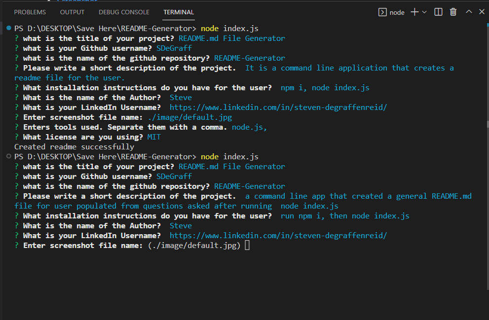

# README.md File Generator

  

  ## Table of Contents
  - [Description](#description)
  - [Installation](#installation)
  - [Screenshot](#screenshot)
  - [License](#license)
  - [Tool List](#toolList)
  - [Github](#github)
  - [LinkedIn](#authorLinkedIn)
  - [Questions](#questions)

  ## Description
    it is a command line app that allows the user to populate a readme.md file with answers to questions in the terminal.

  ## Installation
  install node.js, install inquirer package

  ## Screenshot

[DEMO!](Readme.md%20Generator%20Demo.webm)

  ## License
  none
  

  ## Tool List
  inquirer documentation, Node.js documentation

  ## Questions
  Github: https://github.com/SDeGraf

  LinkedIn: https://linkedin.com/Steven-DeGraffenreid

   
  